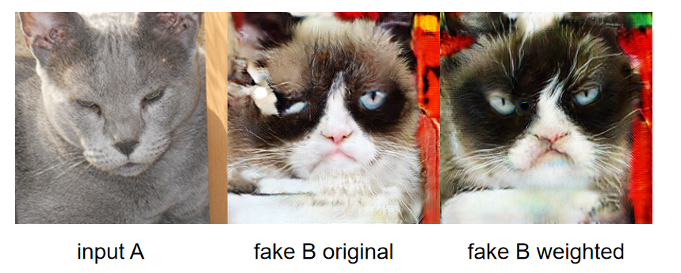

## 原论文实验结果

|  model  | Cityscapes | Cat2Dog | Horse2Zebra |
| ------- | ---------- | ------- | ----------- |
|   CUT   |  56.4      |  76.2   |  45.5       |
| FastCUT |  68.8      |  94.0   |  73.4       |

以下改进基于CUT模型
## 改进1： MaxCUT

- 利用特征空间的语义信息，以最大相似度的样本点作为正样本对。 为了保证特征空间的稳定学习，原本的PatchNCELoss（对应位置作为正样本）也需要保留。
  实现是两种损失的加权，权重为（0.7, 0.3).
- 文件路径：
  - /models/maxcut_model.py
  - /models/patchnce.py中的PatchNCELoss_maxcut
  - /models/networks.py中的改动 
- 命令: 

```bash
python train.py --display_id 0 --no_html \
--dataroot 数据路径 --name 数据名_maxcut --model maxcut --CUT_mode CUT \
--gpu_ids 0
```

- 结果: 

| model  | FID@grumpifyCAT |
| ------ | --------------- |
| CUT    | 91.04           |
| MaxCUT | 87.19           |


## 改进2: BiCUT 

- cut模型中PatchNCELoss会同时用x->y的encoder来编码真实(x域)和生成(y域)的图片，然而对于image translation任务，encoder包含domain-specific信息。参考MUNIT的设计，同时学习x->y和y->x的生成器，并用对应的encoder编码对应域的图片到共享的隐空间。
- 双向的生成器，但并不施加cycle consistency loss, 而是对同一个域的真实图片和生成图片施加similarity loss，可以是global constrastive loss、l1loss等。
- 文件路径:、
  - /models/bicut_model.py
  - /models/patchnce.py中的PatchNCELoss_bicut
  - /models/networks.py中的改动
- 命令:

```bash
python train.py --display_id 0 --no_html \
--dataroot 数据路径 --name 数据名_bicut --model bicut \
--gpu_ids 0  
```

- 结果:

| model | FID@grumpifyCAY |
| ----- | --------------- |
| CUT   | 91.04           |
| BiCUT | 79.66           |


## 改进3: weighted CUT


- cut模型中PatchNCELoss将同一图片中的不同patch取为地位相等的负样本。
  然而，这会导致部分生成图片强制将周围信息分离，生成错误patch。
  我们利用给负样本加权的方式，使得不同patch有不同的负样本权重：距离近的权重小，距离远的权重大。
- 命令:

```bash
python train.py --display_id 0 --no_html \
--dataroot 数据路径 --name 数据名_bicut --model CUT --weighted_neg \
--gpu_ids 0  
```

- 结果:

| model | FID@grumpifyCAY |
| ----- | --------------- |
| CUT   | 91.04           |
| CUT_weighted | 91.02          |


